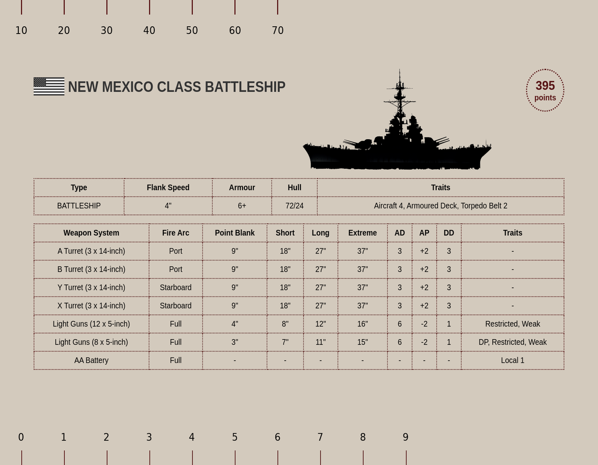

# Victory At Sea Ship Card Generator

Easily and automatically create **Victory at Sea** ship cards for your 3D-printed or custom ships! This project mimics the style, size, and information layout of the official cards provided by **Warlord Games** while allowing you to customize ships you’ve printed yourself.

 <!-- Replace with an actual screenshot -->

---

## Features

- **Automated Card Generation**: Input ship stats via CSV files, and the project generates cards automatically.
- **Mimics Official Style**: Closely replicates the look and feel of the official **Victory at Sea** ship cards.
- **Customizable**: Easily adjust ship stats, weapons, traits, and more to match your custom or unofficial ships.
- **High-Quality Output**: Cards are generated at 300 DPI for sharp and professional printing.
- **Dynamic Design**: Automatically adjusts card layout and number of elements (e.g., weapon systems, hull stats) based on your input data.
- **Fits Dashboard**: Made to fit and line up with my created [dashboard](https://cults3d.com/en/creations/victory-at-sea-dashboard-accessories)

---

## Getting Started

There are two ways to use this script either via the supplied executable, see [running via executable](#running-via-executable).

Or you can download and run the python scripts directly. In which case start with the [Prerequisites Section Below](#prerequisites).

### Prerequisites

To run this project, you need the following installed:

1. **Python 3.8+**
2. **Google Chrome** (or Chromium)
3. **ChromeDriver**
4. **Pillow** (Python Imaging Library)
5. **Selenium**

Install Python dependencies via pip:

```bash
pip install pillow selenium pandas
```

---

### Directory Structure

Ensure your project directory is set up as follows:

```
project_root/
├── generate.py             # Main script
├── shipcard.html           # HTML template for ship cards
├── ships.csv               # Input CSV file for ship data
├── weapon_systems.csv      # Input CSV file for weapon systems
├── output_images/          # Folder where generated cards will be saved
├── ship_images/                 # Folder for ship images
│   ├── placeholder.png     # Placeholder for missing ship images
│   ├── new_mexico.png
├── flags/                  # Folder for nation images
│   ├── placeholder.png     # Placeholder for missing nation images
│   ├── usa.png
```

---

### Input CSVs

#### `ships.csv`

Defines the basic information about each ship.


| Field          | Description                                        | Example                   |
|----------------|----------------------------------------------------|---------------------------|
| `ship_id`      | Unique ID for the ship                             | `1`                       |
| `ship_name`    | Name of the ship                                   | `New Mexico`       |
| `ship_type`    | Type of the ship                                   | `Battleship`              |
| `points`       | Point cost                                         | `395`                     |
| `flank_speed`  | Flank speed in inches                              | `4"`                      |
| `armour`       | Ship's armor rating                                | `6+`                      |
| `hull`         | Ship's hull value (current/max)                    | `72/24`                   |
| `traits`       | Special traits                                     | `Aircraft 4, Armoured Deck, Torpedo Belt 2` |
| `ship_image`   | Path to the ship image relative to the ship_images folder | `new_mexico.png` |
| `nation`       | Path to the nation's image relative to the flags folder | `usa.png`

#### Example

```
ship_id,ship_name,ship_type,points,flank_speed,armour,hull,traits,ship_image
1,HMS King George V,Battleship,600,"5""",7+,89/29,"Aircraft 2, Armoured Deck",images/hms_king_george_v.png
2,New Mexico,Battleship,395,"4""",6+,72/24,"Aircraft 4, Armoured Deck, Torpedo Belt 2",new_mexico.png
```

#### `weapon_systems.csv`

Defines the weapon systems for each ship.


| Field           | Description                                      | Example       |
|-----------------|--------------------------------------------------|---------------|
| `ship_id`       | ID matching the ship from `ships.csv`            | `1`           |
| `weapon_system` | Name of the weapon system                        | `A Turret`    |
| `fire_arc`      | Firing arc of the weapon                         | `Fore`       |
| `point_blank`   | Point-blank range                                | `9"`          |
| `short`         | Short range                                      | `18"`         |
| `long`          | Long range                                       | `27"`         |
| `extreme`       | Extreme range                                    | `37"`         |
| `ad`            | Attack dice                                      | `3`           |
| `ap`            | Armor penetration                                | `+2`           |
| `dd`            | Damage dice                                      | `3`           |
| `traits`        | Special traits                                   | `-`  |

#### Fire Arcs
##### Valid Fire Arcs
Fire arcs are case-insensitive and support the following single or combined arcs:

- Single arcs: `Fore`, `Aft`, `Port`, `Starboard`
- Combined arcs are seperated by a comma: `Fore, Aft`

##### Fire Arc Images
Fire arc images are generated using the `createArc.py` script. These images will be stored in the fire_arcs/ folder and linked dynamically on the ship cards.

#### Example

```
ship_id,weapon_system,fire_arc,point_blank,short,long,extreme,ad,ap,dd,traits
1,A Turret,Fore,9",19",29",39",2,3,3,Restricted
1,B Turret,"Aft, Port",9",19",29",39",2,3,3,Restricted
2,Torpedoes,Port,6",14",21",30",1,1,2,Limited
2,Light Guns,"Fore, Aft, Port, Starboard",10",20",30",40",3,4,4,Armoured
```

---

### Running the Script

To generate cards:

1. Place your input CSVs (`ships.csv`, `weapon_systems.csv`) in the project root.
2. Place any required ship images in the `images/` folder.
3. Run the `generate.py` script:

```bash
python generate.py
```

### Running via Executable

1. Ensure you have the following files and folders in the same directory as the executable:
   - `ships.csv`: Contains ship data.
   - `weapon_systems.csv`: Contains weapon data.
   - `ship_images/`: Directory for ship images.
   - `flags/`: Directory for nation flags.

2. Place the executable in the root directory of your setup.

3. Run the executable:
   - On Windows:
     ```cmd
     VictoryAtSeaCardGenerator.exe
     ```
   - On Linux/Mac:
     ```bash
     ./VictoryAtSeaCardGenerator
     ```

     Or simply double click the file.

Generated cards will be saved in the `output_images/` folder.

---

### Output

- Cards are created as `.png` files, formatted at **14 cm × 10.9 cm** and **300 DPI**, ready for high-quality printing.
- Vertical lines and markers are added dynamically based on ship stats (e.g., hull value).

---

### Donate

To help me with creating new awesome tools and models you can 

[](https://www.buymeacoffee.com/mstelz)

---

### License

This project is licensed under the MIT License. See the [LICENSE](./LICENSE) file for details.

#### Restriction on Generated Content

While the code is open-source, the outputs (e.g., images) generated by this software may not be used for commercial purposes. This includes selling, sublicensing, or otherwise profiting from the generated content. For exceptions or permissions, please contact the author.

---

### Disclaimer

This project is **not affiliated with or endorsed by Warlord Games**. It is intended for personal use to enhance the gameplay experience of **Victory at Sea**.

All references to **Victory at Sea** are trademarks of **Warlord Games**. Any resemblance to official products is purely for compatibility purposes.
